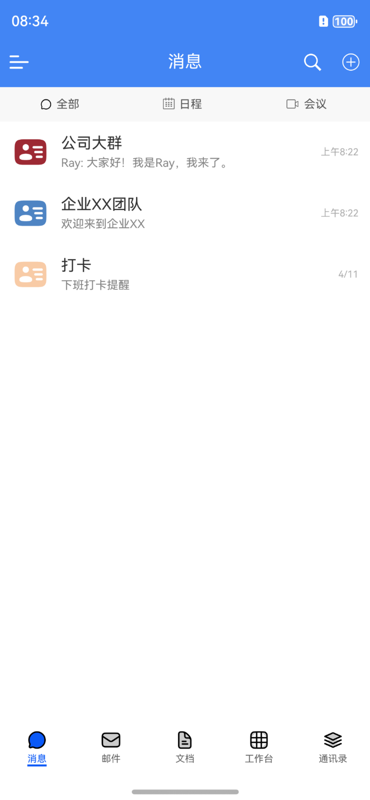
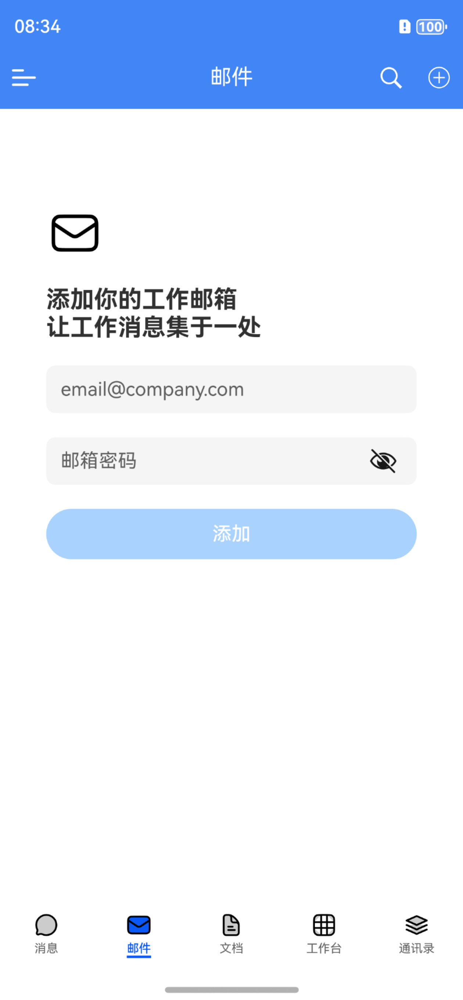
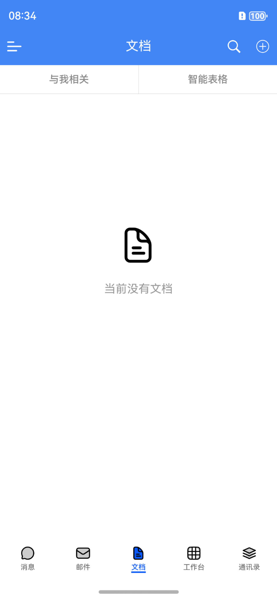
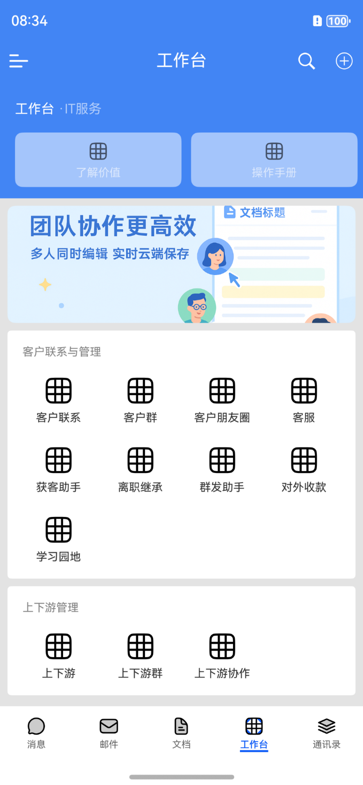
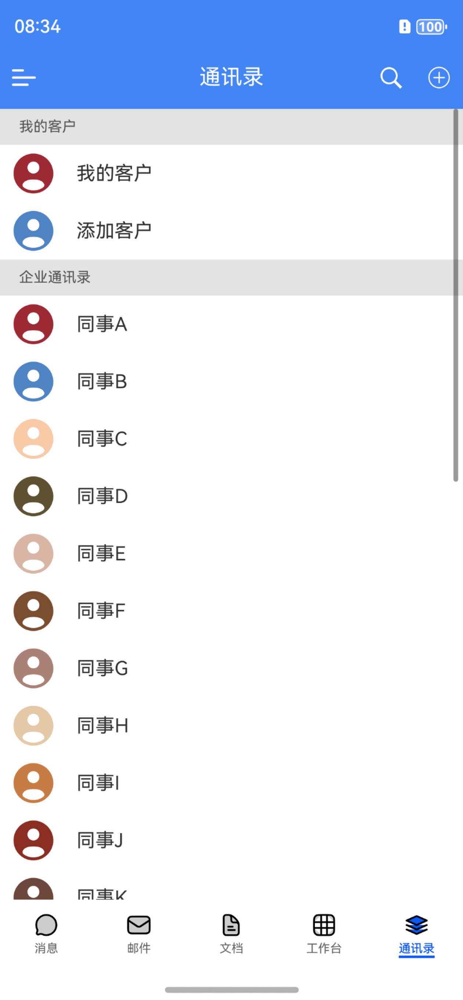

# 鸿蒙版仿企业微信 (ArkIMApp)

一个基于HarmonyOS平台开发的企业微信仿制应用，实现了企业微信的主面界面，并采用现代化的开发架构和设计理念。

## 功能特性

- **🚀MVVM架构**：采用数据驱动UI的设计模式，实现业务逻辑与界面解耦
- **🎨沉浸式状态栏**：完美适配各种屏幕，提供沉浸式体验
- **📋 LazyForEach优化**：大数据量列表流畅滚动，内存占用低

## 项目截图

</img>   </img>
</img>   </img>
</img>   </img>
